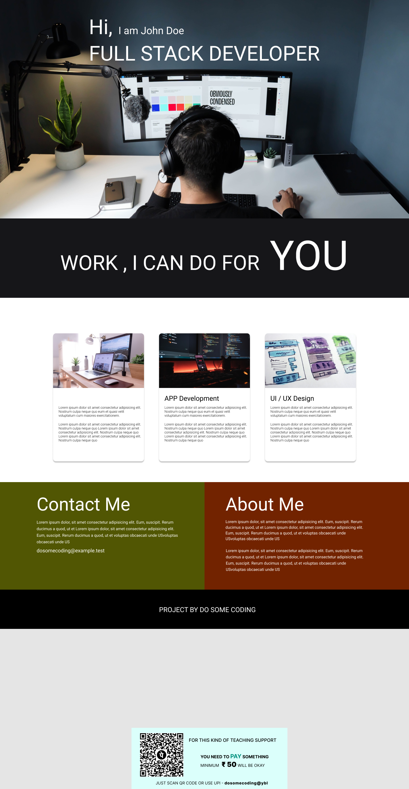

# Responsive-Landing-Page-Design-HTML-CSS-Project-
Just test my HTML CSS skiils to build this small project hope its helpful for you also
# Landing Page

## Description

This is a simple landing page showcasing a personal portfolio for a Full Stack Developer named John Div. The page features an attractive hero section, a list of services offered by the developer, and sections to contact and learn more about him.

## Features

- **Hero Section:** The landing page opens with an impressive hero section, introducing John Div as the Full Stack Developer. The section presents a large heading with a smaller subheading, creating an engaging effect.

- **Services Offered:** The page has a black section that highlights the services offered by the developer. Three cards provide details about web development, app development, and UI/UX design, along with brief descriptions of each service.

- **Contact Me:** The Contact section provides a division with information on how to get in touch with John Div. It includes an email address where interested individuals can reach out.

- **About Me:** Another division in the Contact section provides a brief introduction to John Div and his expertise as a developer.

## Technologies Used

- **HTML:** Used to create the structure and content of the landing page.

- **CSS:** Employed for styling and layout, ensuring a clean and visually appealing design.

## Getting Started

To view this project locally, follow these steps:

1. Clone the repository.
2. Open the `index.html` file in your browser.

Alternatively, you can access the live version of the project at [Landing Page](https://your-live-url-here).

## Deployment

This project can be deployed using any web hosting service. Some recommended hosting providers include:

- [GitHub Pages](https://pages.github.com/)

## Contributions

Contributions and feedback are welcome! Feel free to open an issue or create a pull request.

## License

This project is licensed under the [MIT License](LICENSE).

